# DevOps Tooling Website Solution

In this follow-up tutorial,  we'd introducing a single DevOps Tooling Solution that will consist of the following:

- Jenkins - free and open source automation server used to build CI/CD pipelines.
- Kubernetes - an open-source container-orchestration system for automating computer application deployment, scaling, and management.
- Jfrog Artifactory - Universal Repository Manager supporting all major packaging formats, build tools and CI servers. Artifactory.
- Rancher - an open source software platform that enables organizations to run and manage Docker and Kubernetes in production.
- Grafana - a multi-platform open source analytics and interactive visualization web application.
- Prometheus - An open-source monitoring system with a dimensional data model, flexible query language, efficient time series database and modern alerting approach.
- Kibana - Kibana is a free and open user interface that lets you visualize your Elasticsearch data and navigate the Elastic Stack.
  
In this project you will implement a solution that consists of following components:

* Infrastructure: AWS.

* Webserver Linux: Red Hat Enterprise Linux 8.

* Database Server: Ubuntu 20.04 + MySQL.

* Storage Server: Red Hat Enterprise Linux 8 + NFS Server.

* Programming Language: PHP.

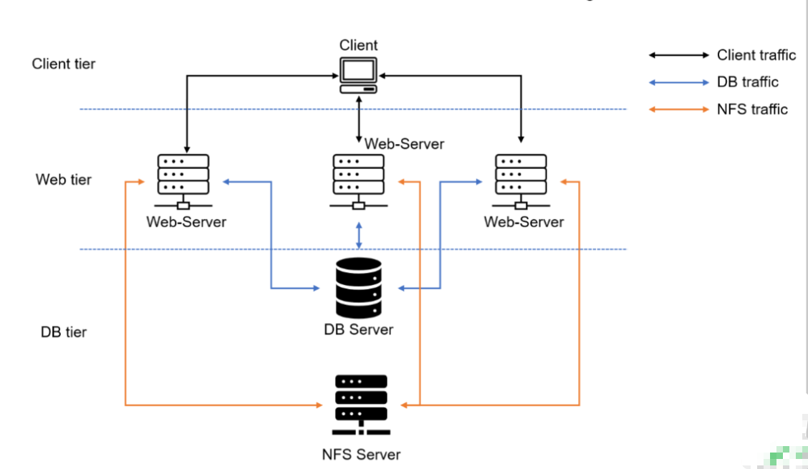

## Step 1 - Prepare the NFS Server
1. Spin up a new EC2 instance with RHEL Linux 8 Operating System.
2. Configure LVM on the Server (Follow the following steps to carry out the LVM config):

- Create volumes in the same availability zone as your instance and attach them.
Like so:

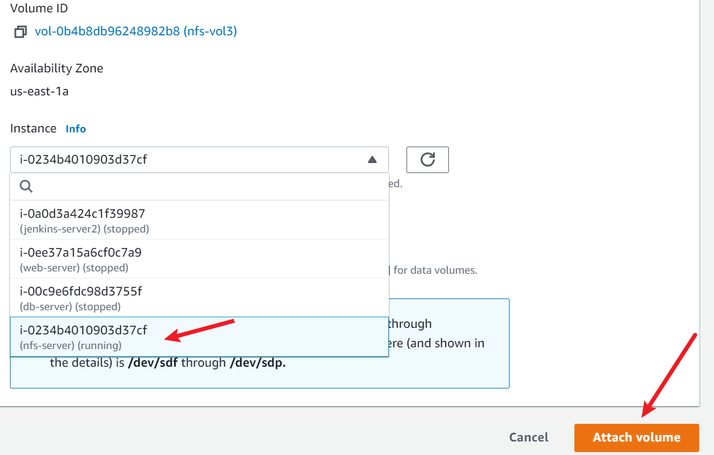

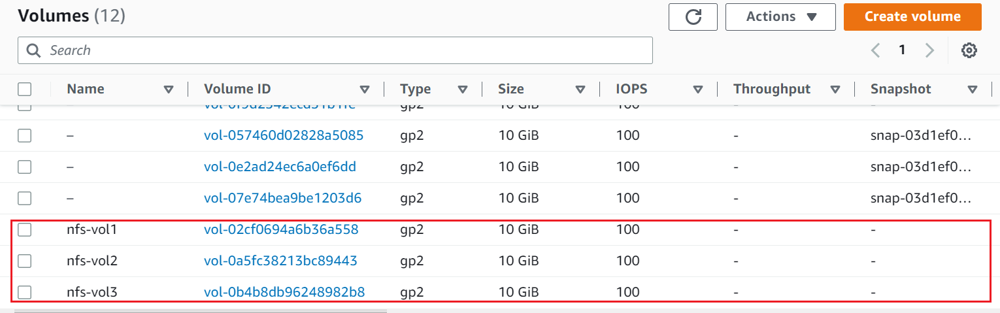
   
To verify, run:

`$ sudo lsblk`

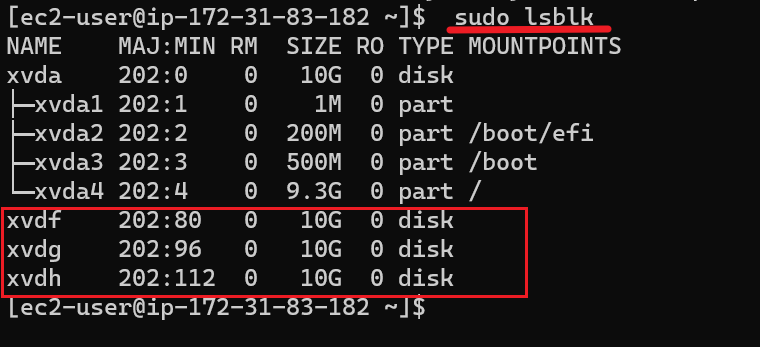

- Use gdisk utility to create a single partition on each of the 3 disks
  
`sudo gdisk /dev/xvdh`
  
```
Output:
GPT fdisk (gdisk) version 1.0.7

Partition table scan:
  MBR: not present
  BSD: not present
  APM: not present
  GPT: not present

Creating new GPT entries in memory.

Command (? for help): n
Partition number (1-128, default 1):
First sector (34-20971486, default = 2048) or {+-}size{KMGTP}:
Last sector (2048-20971486, default = 20971486) or {+-}size{KMGTP}:
Current type is 8300 (Linux filesystem)
Hex code or GUID (L to show codes, Enter = 8300):
Changed type of partition to 'Linux filesystem'

Command (? for help): p
Disk /dev/xvdh: 20971520 sectors, 10.0 GiB
Sector size (logical/physical): 512/512 bytes
Disk identifier (GUID): 7E5A9021-C3AF-4CB9-B5FD-A608BC24D915
Partition table holds up to 128 entries
Main partition table begins at sector 2 and ends at sector 33
First usable sector is 34, last usable sector is 20971486
Partitions will be aligned on 2048-sector boundaries
Total free space is 2014 sectors (1007.0 KiB)

Number  Start (sector)    End (sector)  Size       Code  Name
   1            2048        20971486   10.0 GiB    8300  Linux filesystem

Command (? for help): w

Final checks complete. About to write GPT data. THIS WILL OVERWRITE EXISTING
PARTITIONS!!

Do you want to proceed? (Y/N): y
OK; writing new GUID partition table (GPT) to /dev/xvdh.
The operation has completed successfully.
```
- verify by running: `lsblk`

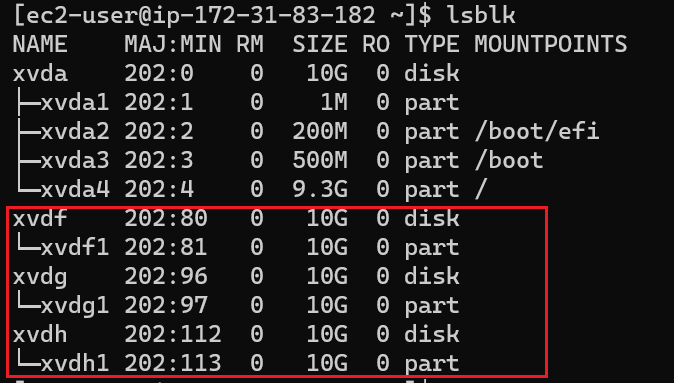

3. Install lvm2 package using:

`sudo yum install lvm2`
   
Run `sudo lvmdiskscan` command to check for available partitions

4.Use pvcreate utility to mark each of 3 disks as physical volumes (PVs) to be used by LVM
```
sudo pvcreate /dev/xvdf1 
sudo pvcreate /dev/xvdg1 
sudo pvcreate /dev/xvdh1
```
```
Output:

  Physical volume "/dev/xvdf1" successfully created.
  Physical volume "/dev/xvdg1" successfully created.
  Physical volume "/dev/xvdh1" successfully created.
  ```
- Verify that your Physical volume has been created successfully by running : `sudo pvs`
```
Output:

   PV         VG Fmt  Attr PSize   PFree
  /dev/xvdf1    lvm2 ---  <10.00g <10.00g
  /dev/xvdg1    lvm2 ---  <10.00g <10.00g
  /dev/xvdh1    lvm2 ---  <10.00g <10.00g
  ```
4. Use vgcreate utility to add all 3 PVs to a volume group (VG). Name the VG webdata-vg:

`sudo vgcreate webdata-vg /dev/xvdh1 /dev/xvdg1 /dev/xvdf1`

Verify that your VG has been created successfully by running: `sudo vgs`

```
Output:

VG         #PV #LV #SN Attr   VSize   VFree
  webdata-vg   3   0   0 wz--n- <29.99g <29.99g
```
5. Use lvcreate utility to create 3 logical volumes:lv-opt lv-apps, and lv-logs
   
`sudo lvcreate -n lv-opt -L 9G webdata-vg`

`sudo lvcreate -n lv-apps -L 9G webdata-vg`

`sudo lvcreate -n lv-logs -L 9G webdata-vg`

```
Output:
Logical volume "lv-opt" created.
Logical volume "lv-apps" created.
Logical volume "lv-logs" created.
```
run `sudo lvs`

```
Output:
  LV      VG         Attr       LSize  Pool Origin Data%  Meta%  Move Log Cpy%Sync Convert
  lv-apps webdata-vg -wi-a----- 9.00g
  lv-logs webdata-vg -wi-a-----  9.00g
  lv-opt  webdata-vg -wi-a----- 9.00g
```
- Format the disks as xfs
  
```
sudo mkfs -t xfs /dev/webdata-vg/lv-apps
sudo mkfs -t xfs /dev/webdata-vg/lv-logs
sudo mkfs -t xfs /dev/webdata-vg/lv-opt
```
`sudo lsblk`
```
Output:
[ec2-user@ip-172-31-89-198 ~]$ sudo lsblk
NAME                     MAJ:MIN RM  SIZE RO TYPE MOUNTPOINTS
xvda                     202:0    0   10G  0 disk
├─xvda1                  202:1    0    1M  0 part
├─xvda2                  202:2    0  200M  0 part /boot/efi
├─xvda3                  202:3    0  500M  0 part /boot
└─xvda4                  202:4    0  9.3G  0 part /
xvdf                     202:80   0   10G  0 disk
└─xvdf1                  202:81   0   10G  0 part
  └─webdata--vg-lv--opt  253:2    0    9G  0 lvm
xvdg                     202:96   0   10G  0 disk
└─xvdg1                  202:97   0   10G  0 part
  └─webdata--vg-lv--logs 253:1    0    9G  0 lvm
xvdh                     202:112  0   10G  0 disk
└─xvdh1                  202:113  0   10G  0 part
  └─webdata--vg-lv--apps 253:0    0    9G  0 lvm
  ```
6. Create mount points on /mnt directory for the logical volumes as follow:

- Mount lv-apps on /mnt/apps – To be used by webservers
- Mount lv-logs on /mnt/logs – To be used by webserver logs
- Mount lv-opt on /mnt/opt – To be used by Jenkins server 
```
sudo mkdir /mnt/apps

sudo mkdir /mnt/logs

sudo mkdir /mnt/opt

sudo mount /dev/webdata-vg/lv-apps /mnt/apps

sudo mount /dev/webdata-vg/lv-logs /mnt/logs

sudo mount /dev/webdata-vg/lv-opt /mnt/opt
```
>Once mount is completed run:

`sudo blkid` to get the UUID, edit the fstab file accordingly

`sudo vi /etc/fstab`

Verify the mount points

`sudo mount -a `
`sudo systemctl daemon-reload`

7. Install NFS server, configure it to start on reboot and make sure it is up and running

```
sudo yum -y update

sudo yum install nfs-utils -y

sudo systemctl start nfs-server.service

sudo systemctl enable nfs-server.service

sudo systemctl status nfs-server.service
```
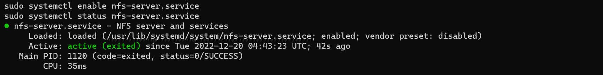

8. Set the mount point directory to allow read and write permissions to our webserver 
```
sudo chown -R nobody: /mnt/apps
sudo chown -R nobody: /mnt/logs
sudo chown -R nobody: /mnt/opt
 
sudo chmod -R 777 /mnt/apps
sudo chmod -R 777 /mnt/logs
sudo chmod -R 777 /mnt/opt
 
sudo systemctl restart nfs-server.service
```
Restart NFS server 

`sudo systemctl restart nfs-server`

>Note: In this project, we will be creating our NFS-server, web-servers and database-server all in the same subnet

9. Next we configure NFS to interact with clients present in the same subnet.

We can find the subnet ID and CIDR in the Networking tab of our instances

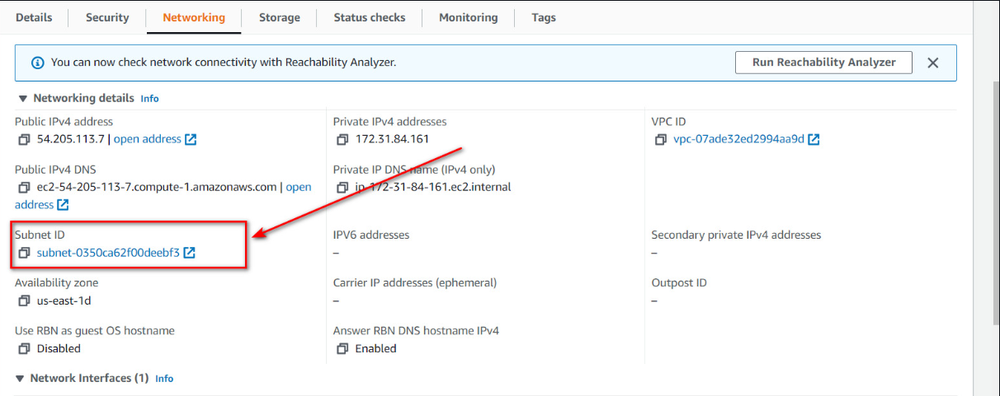

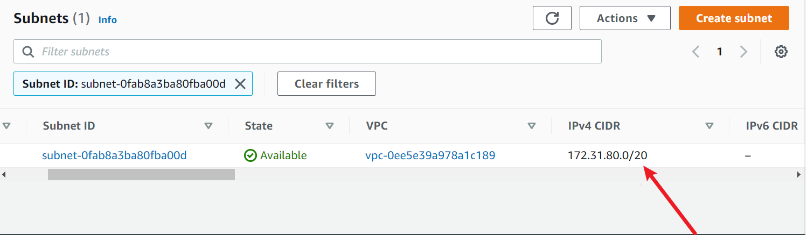

`sudo vi /etc/exports`

Edit the file like the image below:

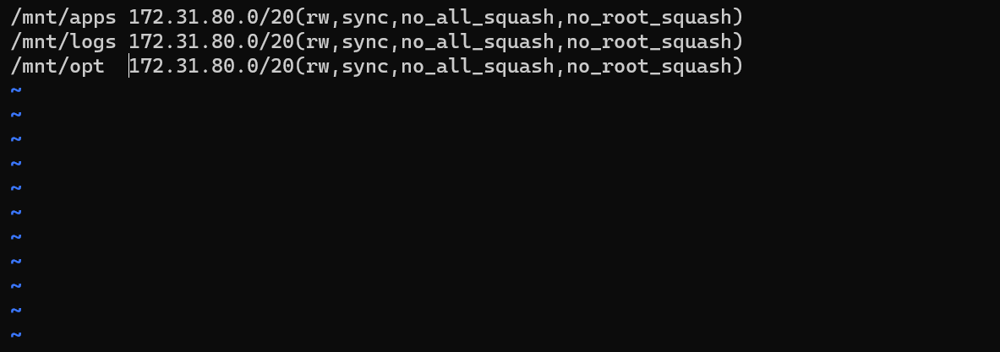
 
 - run this command to export 

`sudo exportfs -arv`

```
Output:
exporting 172.31.0.0/16:/mnt/opt
exporting 172.31.0.0/16:/mnt/logs
exporting 172.31.0.0/16:/mnt/apps
```
10. Check which port is used by NFS and open it using Security Groups (add new Inbound Rule)
    
`rpcinfo -p | grep nfs`

```
Output:

100003    3   tcp   2049  nfs
100003    4   tcp   2049  nfs
100227    3   tcp   2049  nfs_acl
```
 >In order for NFS server to be accessible from your client, you must also open following ports:

 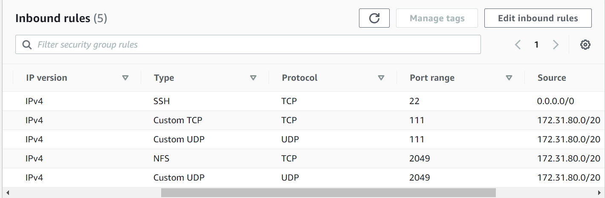

 ## Step 2 -Confiqure the Web Server
Create an Ubuntu Server on AWS which will serve as our Database. **Ensure its in the same subnet as the NFS-Server**

- Install mysql-server

```
sudo apt update

sudo apt upgrade

sudo apt install mysql-server

mysql --version

sudo mysql_secure_installation
```
- Create a database user with name webaccess and grant permission to the user on tooling db to be able to do anything only from the webservers subnet cidr
  
  `sudo mysql`

```
sudo mysql
Welcome to the MySQL monitor.  Commands end with ; or \g.
Your MySQL connection id is 12
Server version: 8.0.31-0ubuntu0.20.04.2 (Ubuntu)

Copyright (c) 2000, 2022, Oracle and/or its affiliates.

Oracle is a registered trademark of Oracle Corporation and/or its
affiliates. Other names may be trademarks of their respective
owners.

Type 'help;' or '\h' for help. Type '\c' to clear the current input statement.

mysql> CREATE DATABASE tooling;
Query OK, 1 row affected (0.01 sec)

mysql> show databases;
+--------------------+
| Database           |
+--------------------+
| information_schema |
| mysql              |
| performance_schema |
| sys                |
| tooling            |
+--------------------+
5 rows in set (0.02 sec)

mysql> create database tooling;
Query OK, 1 row affected (0.01 sec)

mysql> create user 'webaccess'@'172.31.0.0/16' identified by 'password';
Query OK, 0 rows affected (0.02 sec)

mysql> grant all privileges on tooling.* to 'webaccess'@'172.31.0.0/16';
Query OK, 0 rows affected (0.01 sec)

mysql> flush privileges;
Query OK, 0 rows affected (0.00 sec)

mysql> exit
Bye
```
>The ip address is the webserver's IPv4 CIDR

## Step 3 -Preparing Web Servers
Create a RHEL EC2 instance on AWS which serves as our web server. Also remember to have in it in same subnet

A couple of configurations will be done on the web servers:

- configuring NFS client
- deploying tooling website application
- configure servers to work with database

1. Installing NFS-Client

`sudo yum install nfs-utils nfs4-acl-tools -y`

Mount /var/www/ and target the NFS server’s export for apps

`sudo mkdir /var/www`

`sudo mount -t nfs -o rw,nosuid <NFS-Server-Private-IP-Address>:/mnt/apps /var/www`

Verify that NFS was mounted successfully by running `df -h`. 

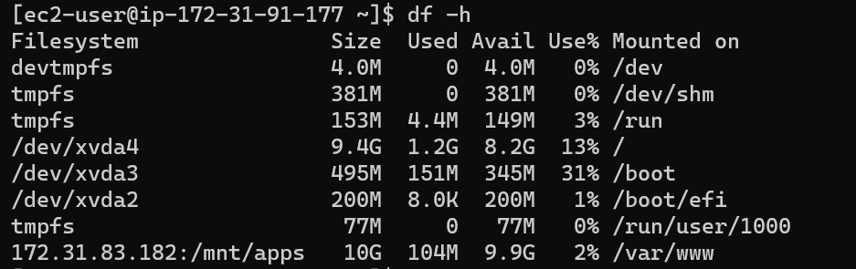

>You can test the mount by creating a file on the web server and checking to see it on the nfs server

Make sure that the changes will persist on Web Server after reboot:

`sudo vi /etc/fstab`

add following line:
```
<NFS-Server-Private-IP-Address>:/mnt/apps /var/www nfs defaults 0 0
```
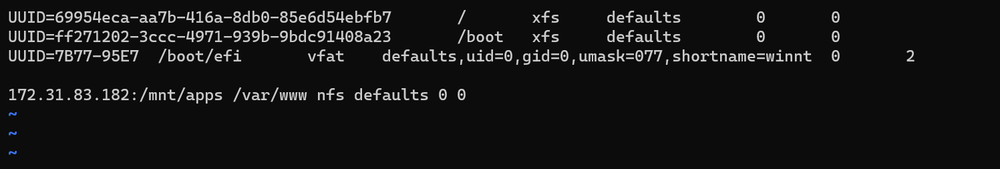

2. Installing Apache and Php
```
sudo yum install httpd -y

sudo dnf install https://dl.fedoraproject.org/pub/epel/epel-release-latest-8.noarch.rpm

sudo dnf install dnf-utils http://rpms.remirepo.net/enterprise/remi-release-8.rpm

sudo dnf module reset php

sudo dnf module enable php:remi-7.4

sudo dnf install php php-opcache php-gd php-curl php-mysqlnd

sudo systemctl start php-fpm

sudo systemctl enable php-fpm

sudo setsebool -P httpd_execmem 1
```
We can see that both /var/www and /mnt/apps contains same content. This shows that both mount points are connected via NFS.

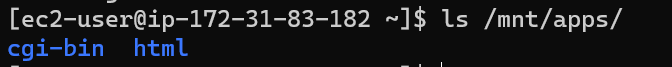
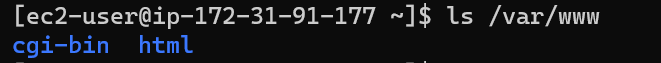

3. We locate the log folder for Apache on the Web Server and mount it to NFS server’s export for logs. Make sure the mount point will persist after reboot.

`sudo mount -t nfs -o rw,nosuid <NFS-Server-Private-IP-Address>:/mnt/logs /var/log/httpd`

`sudo vi /etc/fstab`

4. Fork the tooling source code to your Github account. <https://github.com/Typhoenix/tooling?organization=Typhoenix&organization=Typhoenix>

5.Deploy the tooling website’s code to the Webserver. Ensure that the html folder from the repository is deployed to /var/www/html
 
`sudo yum install git -y`


>Do not forget to open TCP port 80 on the Web Server.


>If you encounter 403 Error – check permissions to your /var/www/html folder and also disable `SELinux sudo setenforce 0`
To make this change permanent – open following config file 

`sudo vi /etc/sysconfig/selinux`

and set **SELINUX=disabled,** then restart httpd;

```
sudo systemctl start httpd
sudo systemctl status httpd
```


6. Update the website’s configuration to connect to the database (in **/var/www/html/functions.php** file).


 
 >edit the database private ip address, database username and database name. save and quit

 7. Apply tooling-db.sql script to your database using this command
   
`mysql -h <databse-private-ip> -u <db-username> -p <db-pasword> < tooling-db.sql`

>To do this, you have to follow the following steps:

- Install mysql on web server
  
`sudo yum install mysql -y`

- Open port 3306 on database server
  


- You'd also need to configure MySQL server to allow connections from remote hosts.
  
`sudo vi /etc/mysql/mysql.conf.d/mysqld.cnf`


- Restart mysql
  ```
  sudo systemctl restart mysql
  sudo systemctl status mysql
  ```


- From the webserver, apply tooling-db.sql script to your database 

`mysql -h <databse-private-ip> -u <db-username> -p <dbname> < tooling-db.sql`

8. If it returns no error, create in MySQL a new admin user with username: myuser 
 


9. Open the website in your browser http://Web-Server-Public-IP-Address-or-Public-DNS-Name/index.php and make sure you can login into the website with myuser user.
    
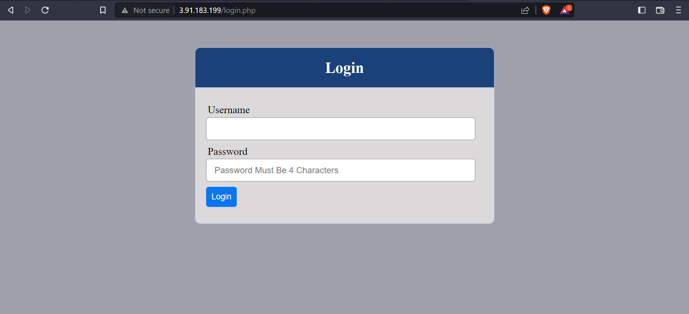

> I will be logging in using user name "admin" and corresponding password


### Congratulations!


**You have just implemented a web solution for a DevOps team using LAMP stack with remote Database and NFS servers.**


new
